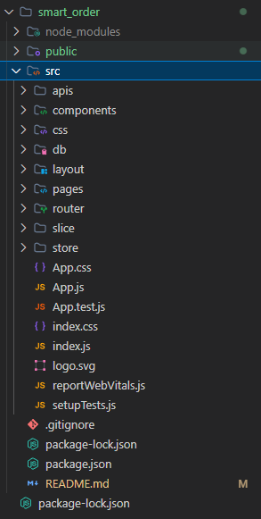
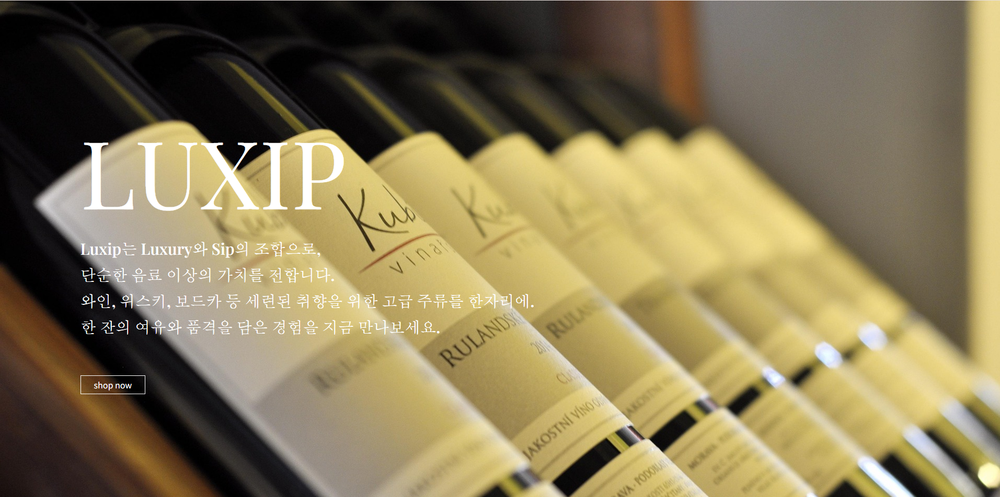
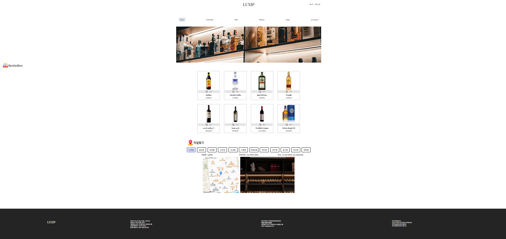
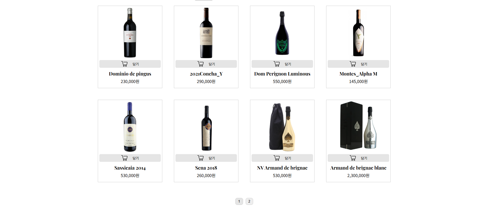

# 🍷 LUXIP – Premium Liquor Experience (React Frontend Project)

Luxip은 고급 주류 쇼핑을 주제로 제작된 **React 기반 프론트엔드 프로젝트**입니다.  
간결하고 직관적인 UI/UX를 통해 와인·위스키 등의 프리미엄 주류를 탐색할 수 있도록 구현했습니다.

프론트엔드 단독 프로젝트로서,  
React 컴포넌트 구조 설계 · 상태 관리 · 라우팅 · json-server 기반 Mock API 활용 등을 목표로 개발되었습니다.

---

## 🔗 GitHub Repository

https://github.com/Winn95/GC-Academy-First-Project.git

---

## 📌 Overview

- 프론트엔드 역량 강화를 위한 React 단독 프로젝트(1차 팀플 프로젝트 (3인))
- 랜딩 페이지, 상품 리스트, 장바구니 등 쇼핑몰 UI 흐름 구현
- json-server 기반으로 실 서비스와 유사한 데이터 처리 구조 적용
- 반응형 레이아웃 일부 적용하여 UX 강화

---

## 🛠 Tech Stack

  <!-- Frontend -->
  
  

  <!-- Styling -->
  
  
  

  <!-- State -->
  

  <!-- API -->
  
  

  <!-- Build -->
  
  

  <!-- GitHub -->
  
  

---

## ⭐ Features

- 메인 랜딩 페이지 (브랜드 소개 + 풀스크린 배너)
- 카테고리 기반 상품 리스트
- 상품 상세 화면 / 모달 UI
- 장바구니 페이지 (수량 조절 포함)
- json-server 기반 Mock API 구성
- 반응형 일부 적용(UI 레이아웃 보정 포함)

---

## 📁 Project Structure

프로젝트 간단 구조

🎨 Screenshots

1. 메인 랜딩 페이지, 배너 이미지 + 브랜드 메시지, Shop Now 버튼 배치

2. 상품 리스트 페이지, 이미지, 상품명, 가격 표시, hover 효과로 주요 정보 강조

3. 상품 상세 페이지, 상세 정보 및 추가 UI

4. 장바구니 페이지

🚀 Installation & Run
bash
코드 복사
# 프로젝트 클론
git clone https://github.com/Winn95/GC-Academy-First-Project.git
cd GC-Academy-First-Project

# 패키지 설치 + json-server 실행 (사용 시)
npm install
json-server --watch order_member.json --port 3001

# React 실행
npm start
🔍 Key Points
컴포넌트 단위 설계로 UI 재사용성 확보

json-server로 실 서버와 유사한 환경 구성

React Router를 이용한 SPA 구조 설계

초보자가 가장 어려워하는 상태 전달 흐름 직접 구현

배너/텍스트 레이아웃 구성 및 스타일링 실습

💡 Challenges
이미지 배너 위 텍스트 가독성 조정

Mock API 데이터 구조 설계

페이지 이동 시 데이터 전달 설계

초기 React 프로젝트 구조 설계 난이도

📈 Future Improvements
실제 백엔드 API 연동

로그인/회원가입 기능 추가

상품 검색/필터 기능 고도화

모바일 반응형 전체 적용

UI/UX 애니메이션 추가

👤 Developer
이승준 (Jun)
GitHub: https://github.com/Winn95
Email: (원하시면 추가)
